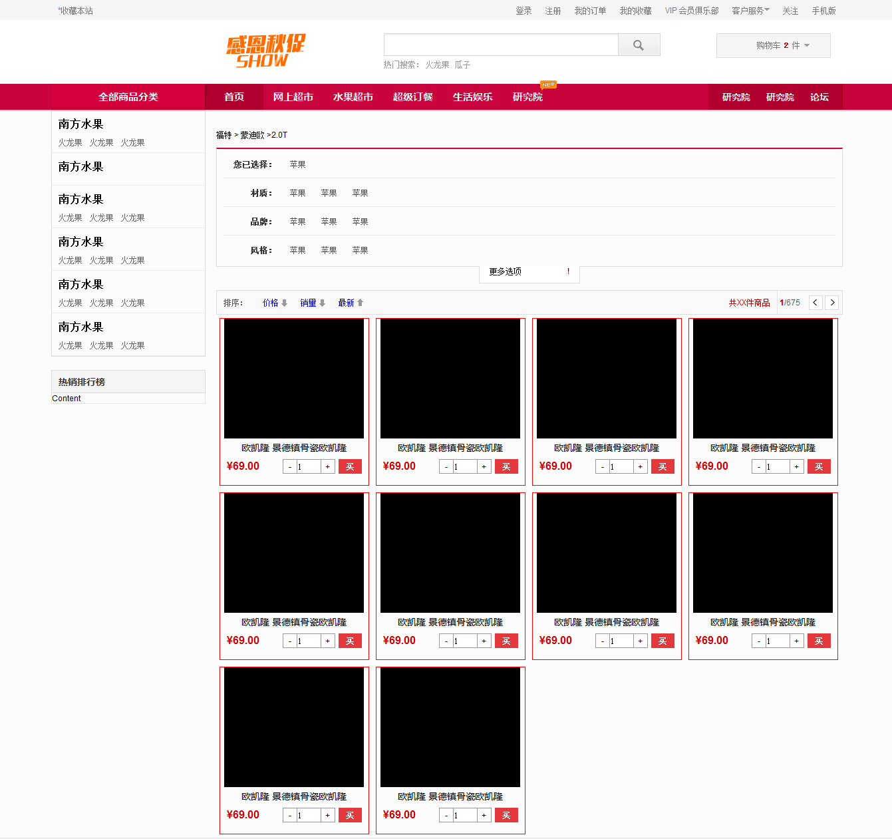

#最最最重要的readme

##[博客](http://www.cnblogs.com/lixiaoliuer/p/6985682.html)

##有感
html或者是前端语言真的是逼死强迫症最好的编程语言没有之一。当看到不能接受的字间距或者是行间距的时候，那种尝试了一个小时只是为了改变间距而不得的心情确实让人崩溃。例如，我尝试过用ul标签来改善字间距，除了要解决字体前面的.还要改变排列的方向，但是在网上找了几个方法试了一下都没有成功，最后无奈放弃。  
这当然不是压死骆驼的最后一根稻草，还有上传图片时的大小以及你永远不知道你现在看到的这个< /dir >是对应上面的哪个< dir >时的暴躁。明明只是一行标题为毛就可以写出这么一大坨代码。  

##功能介绍
完成如下图所示的一个网页

##目录结构
day13  
	├── img 		# 图片文件  
	├── home_work 	# html文件  
	├── homework 	# css文件  

##运行说明
直接打开home_work文件

##测试环境
OS:Windows 7 旗舰版  
编译器：HBuilder